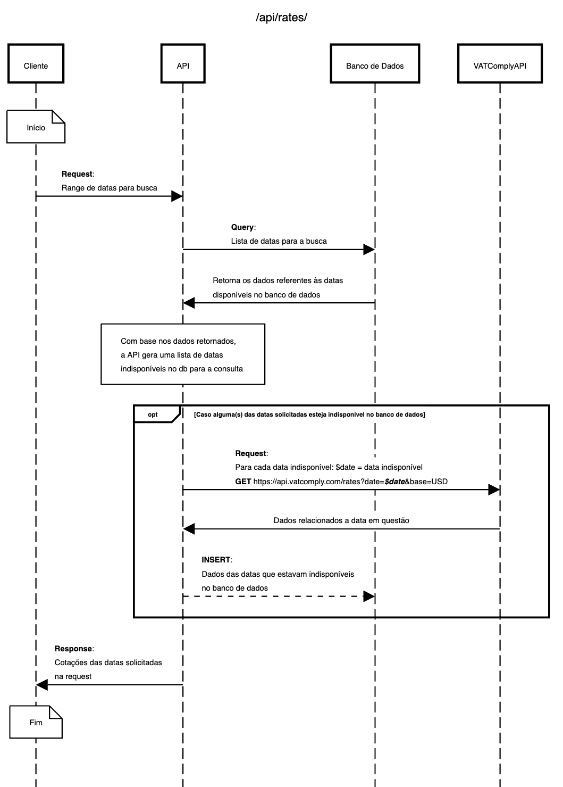

# Arquitetura do Projeto

## Abordagem
Dado o proposto, ter um endpoint para o consumo de dados do frontend onde os dados retornados 
seriam provenientes da `API VATComply` e seriam salvos no banco de dados e outro endpoint onde as 
consultas seriam feitas apenas ao banco de dados, ter um único endpoint capaz de utilizar os 
recursos da melhor forma possível pareceu-me a melhor solução.

Neste caso tanto o frontend quanto qualquer aplicação terá acesso ao mesmo endpoint. Este endpoint 
será responsável por sempre salvar novos dados não presentes no banco dados. Essa abordagem foi 
selecionada, pois em alguns casos, APIs externas podem possuir limit-rate de requests ou até mesmo
cobranças a cada X chamadas, sem contar um possível downtime na aplicação, portanto buscar os dados 
primeiro no banco de dados para só então fazer a requisição para uma API externa pode evitar 
cobranças desnecessárias, bloqueio de IP por multiplas requests em pouco tempo e inclusive diminui
o tempo de resposta da API conforme mais datas forem sendo populadas no banco de dados.

Dado o contexto, quando uma requisição é feita, o endpoint checa primeiro no banco de dados se
existe informação suficiente para o range de datas fornecido na requisição. Caso o banco de dados 
não possua informações suficientes para todas as datas presentes no range de datas fornecido, a 
aplicação irá buscar essas informações na `API VATComply`, salvar os resultados no banco de dados e
agregar as informações na resposta final para o cliente.

Confira o Diagrama de Sequência abaixo com a ilustração do fluxo.

## Diagrama de Sequência
